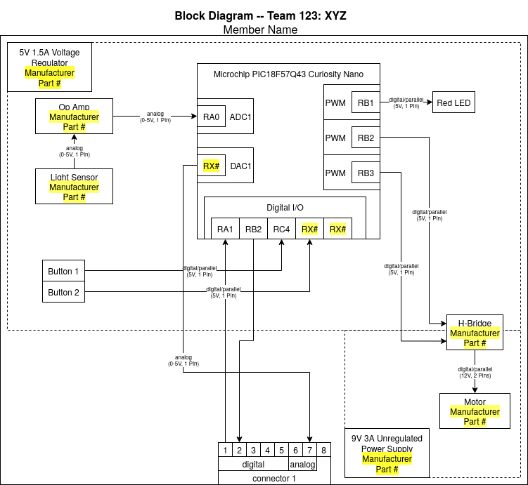

## Introduction
This has some basic start help here. The complete initial start guide can be view ["here"](https://embedded-systems-design.github.io/EGR304DataSheetTemplate/05-Schematic/schematic/)

**Bold Text**
_Italic Text_
**_Bold and Italic Text_**

## Research Question

* Bullet Point 1
* Bullet Point 2
* Bullet Point 3

## Images

<figure>
    
    <figcaption><strong>Figure 2:</strong> Innovation Showcase Spring '25, where the products were a STEM-themed display that demonstrates a single scientific/engineering concept with the intended user of K-12 students interested in learning about science, technology, engineering, or math.</figcaption>
</figure>

## Results

1. Numbered Point 1
1. Numbered Point 2
1. Numbered Point 3

