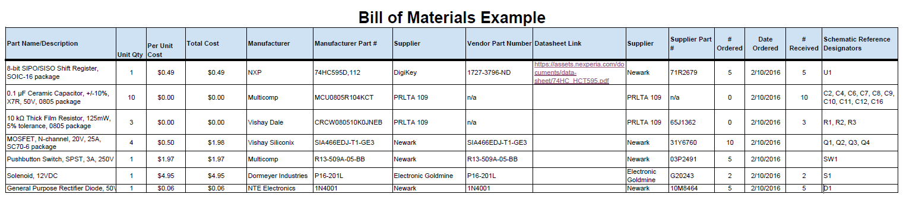

## Overview
written context

## Bill of Materials Example (as Table)

*Table ##: An example of one approach to adding your BOM table to this section.*

| **Part Name/Description** | **Qty** | **Unit Cost** | **Total Cost** | **Manufacture** | **Manufacturer #** | **Vendor Link** |**Datasheet Link** | **Schematic Reference Designators** |
|:--------------------|:----|:---------------|:-----|:--------|:-----|:-----|:----|:-----|
8-bit SIPO/SISO Shift Register, SOIC-16 package | 1 | $0.49 | $ 0.49 | NXP | 74HC595D,112 | [DigiKey](https://www.digikey.com/en/products/detail/nexperia-usa-inc/74HC595D-112/763550) | [datasheet link](https://assets.nexperia.com/documents/data-sheet/74HC_HCT595.pdf) | U1 |
0.1 µF Ceramic Capacitor, +/-10%, X7R, 50V, 0805 package |10 | 0.2750 | $2.75 | KEMET | C0805F104K5RACTU | PRLTA 109 |n/a | C2, C4, C6, C7, C8, C9, C10, C11, C12, C16

Note: Setting it up as a table is nice because it is completely viewable without scaling issues. <ins>Downside</ins> is that you have to do the math.

* You could also import your BOM via a screenshot of the spreadsheet created BOM

## Bill of Materials Example (as Image)
{style width: "2000"}
**Figure 2:** Example Bill of Materials as a screenshot.

As you can see, the text can be difficult to read without opening the image.
